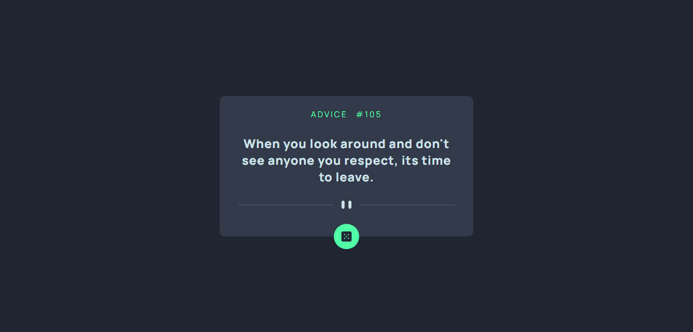

### Links

- Solution URL: [https://www.frontendmentor.io/solutions/advice-generator-app-with-advice-slip-json-api-s8xjSxFVVT]
- Live Site URL: [https://advice-generator-delta-five.vercel.app/]

### The challenge

Users should be able to:

- View the optimal layout for the app depending on their device's screen size
- See hover states for all interactive elements on the page
- Generate a new piece of advice by clicking the dice icon

### Screenshot

### Built with

- HTML5
- CSS
- Vue 3
- API => Advice Slip JSON

# Frontend Mentor - Todo app solution

This is a solution to the [Advice generator challenge on Frontend Mentor](https://www.frontendmentor.io/challenges/advice-generator-app-QdUG-13db).

